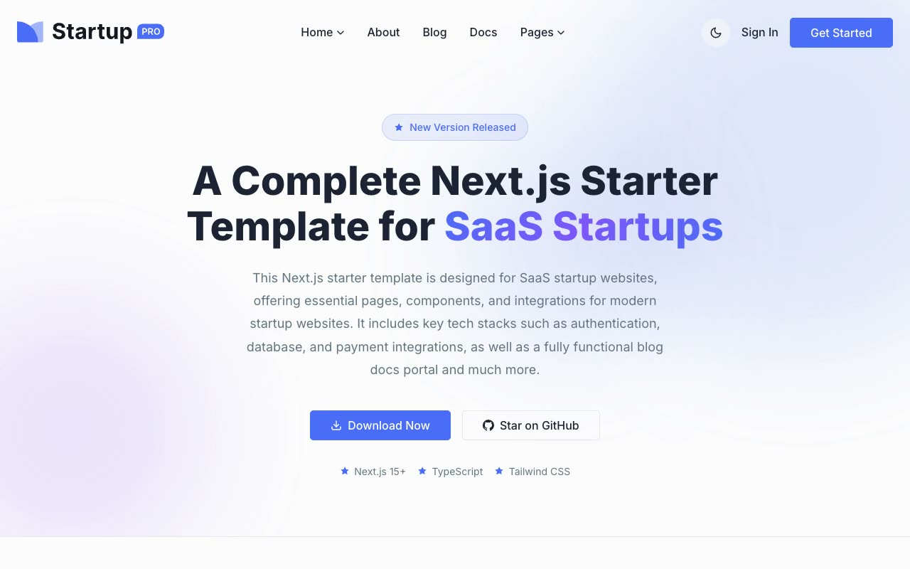

# Startup Pro

[](./demo.mp4)

A self-contained recreation of the Startup Pro SaaS and business template using HTML, CSS, and JavaScript.

## Pages

- `index.html`
- `home-2.html`
- `about.html`
- `blogs.html`
- `blogs-2.html`
- `blog-detail.html`
- `pricing.html`
- `faq.html`
- `contact.html`

## Features

- Responsive navigation and nested mobile menus
- Persistent light and dark themes
- Pricing, FAQ, and form interactions
- Accessible headings, controls, and fields
- Local images and fonts

## Run

```sh
python3 -m http.server 8080
```

Then open `http://localhost:8080/`.

Reference: [Startup Pro](https://startup-pro.demo.nextjstemplates.com/)
