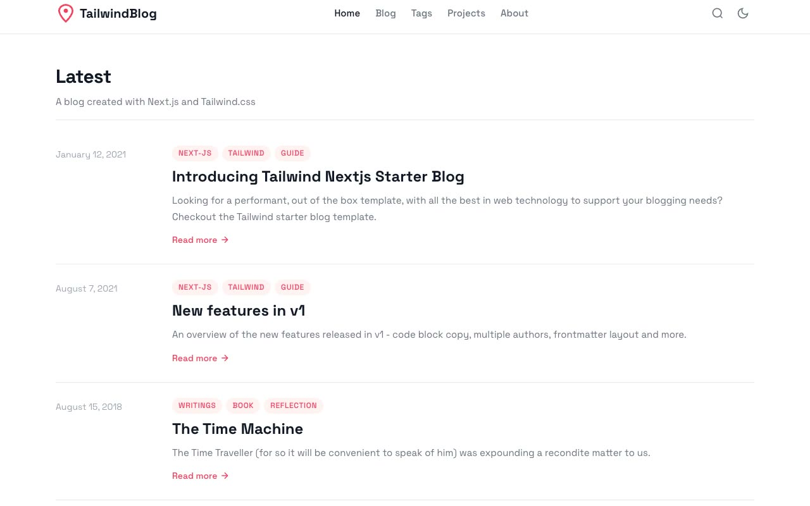

# Tailwind Next.js Starter Blog

[](./demo.mp4)

A self-contained static reproduction of the [Tailwind Next.js Starter Blog](https://tailwind-nextjs-starter-blog.vercel.app) by Timothy Lin, implemented with HTML, CSS, and JavaScript.

## Run

Serve this directory with any static file server:

```sh
python3 -m http.server
```

Then open `http://localhost:8000`.

## Pages

- `index.html`: home and recent posts
- `blog.html`: searchable post listing
- `tags.html`: tag index
- `projects.html`: project showcase
- `about.html`: author profile
- `blog/*.html`: five complete articles
- `tags/*.html`: ten tag archives

## Features

- Persistent light and dark themes
- Responsive navigation with keyboard support
- Client-side post filtering
- Accessible code-copy controls
- Responsive article, tag, project, and author layouts
- Scroll-to-top controls on long pages

The original design and project are credited to Timothy Lin and its contributors. See the [live reference](https://tailwind-nextjs-starter-blog.vercel.app) and [source repository](https://github.com/timlrx/tailwind-nextjs-starter-blog).

`prompt.md` contains the detailed build specification. `demo.mp4` shows the template in motion.
