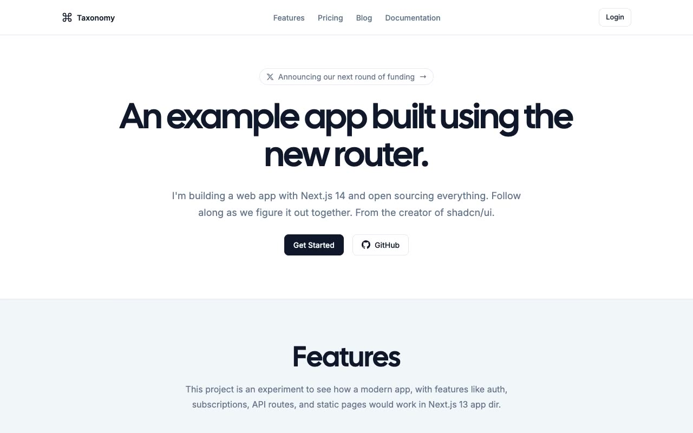

# Taxonomy

[](./demo.mp4)

A self-contained HTML, CSS, and JavaScript reproduction of [Taxonomy](https://tx.shadcn.com), the shadcn demo application for Next.js routing, server components, authentication, and subscriptions.

## Run

Serve this directory with any static file server:

```sh
python3 -m http.server 8080
```

Then open `http://localhost:8080`.

## Pages

- Marketing home, blog, article, pricing, and guides
- Documentation introduction, overview, components, code blocks, and style guide
- Login and registration flows

## Features

- Persistent light and dark themes
- Responsive marketing and documentation navigation
- Keyboard-accessible mobile menu
- Accessible authentication forms
- Self-contained, no-build implementation

The original design and project are credited to shadcn and its contributors. See the [live reference](https://tx.shadcn.com) and [source repository](https://github.com/shadcn-ui/taxonomy).

`prompt.md` contains the detailed build specification. `demo.mp4` shows the template in motion.
