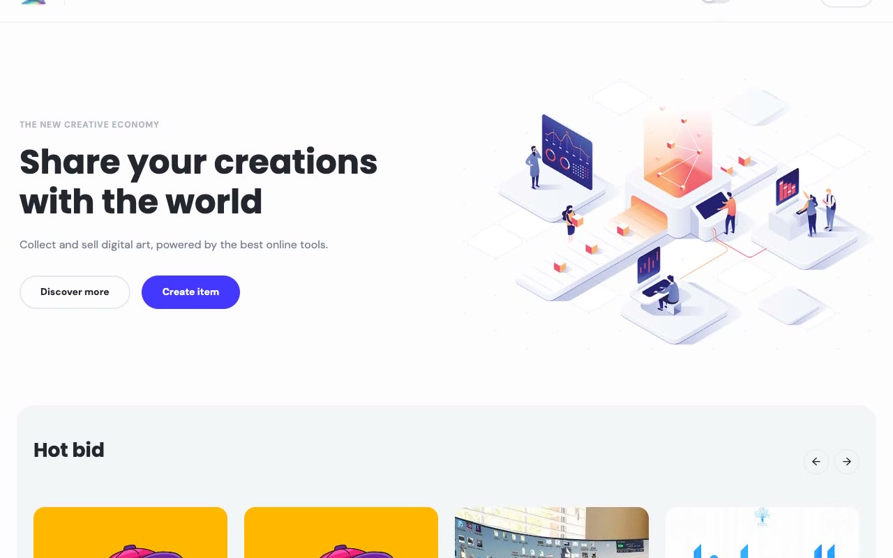

# uNFT Marketplace

[](./demo.mp4)

A self-contained HTML, CSS, and JavaScript reproduction of the Cosmic uNFT Marketplace for digital art and collectible storefronts.

## Run

Serve this directory with any static file server:

```sh
python3 -m http.server 8080
```

Then open `http://localhost:8080`.

## Pages

- `index.html`: marketplace home and discovery grid
- `about.html`: marketplace introduction
- `search.html`: keyword, category, color, and price filtering
- `upload-details.html`: gated collectible creation flow
- `item/*.html`: fifty product detail routes backed by the shared catalog

## Features

- Persistent light and dark themes
- Responsive navigation drawer and authentication dialog
- Keyboard focus restoration for overlays
- Client-side filtering and searchable catalog
- Shared product, header, footer, and modal rendering
- Fully local typography and catalog imagery

The original design and project are credited to Cosmic and its contributors. See the [live reference](https://unft-marketplace.vercel.app/) and [source repository](https://github.com/cosmicjs/nextjs-marketplace).

`prompt.md` contains the detailed build specification. `demo.mp4` shows the marketplace in motion.
