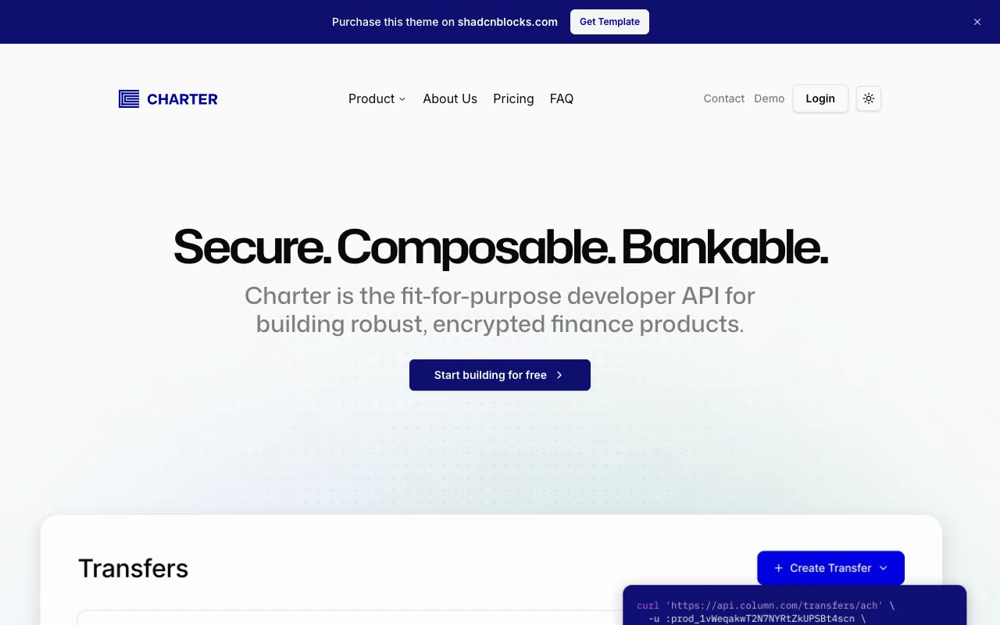

# Charter Fintech Website

[](./demo.mp4)

A self-contained reproduction of the premium Charter template from Shadcnblocks. The nine-page static site includes its finance API presentation, light and dark themes, responsive navigation, product menus, FAQ accordions, forms, authentication screens, pricing, company information, and legal pages.

## Run

Serve this directory with any static file server:

```sh
python3 -m http.server
```

Open <http://localhost:8000> in a browser. No build step or package installation is required.

## Reference

- [Charter template listing](https://www.shadcnblocks.com/template/charter)
- [Charter live demo](https://charter-nextjs-template.vercel.app/)
