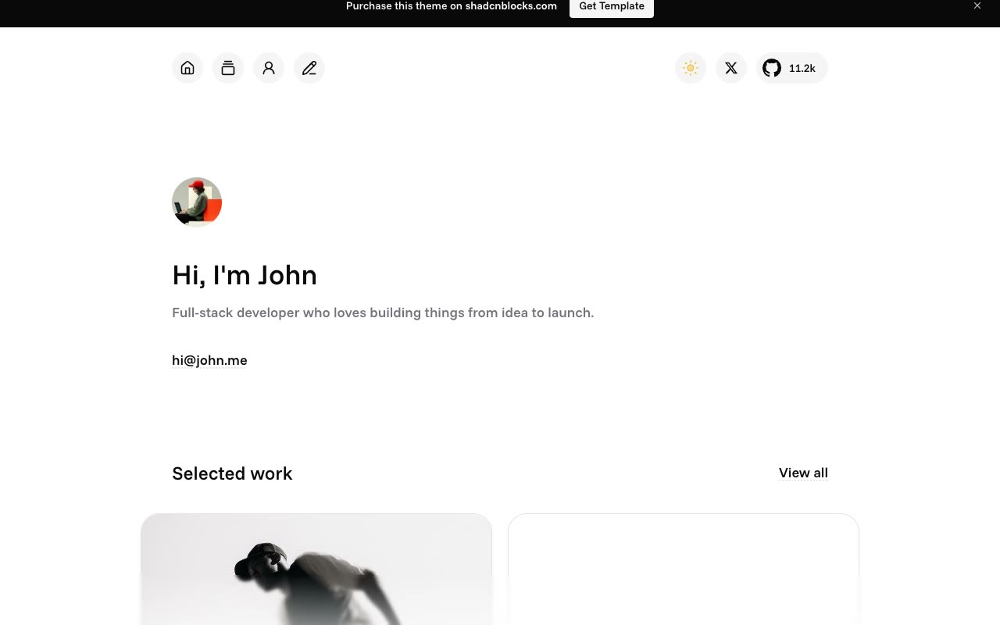

# Echo Portfolio Website

[](./demo.mp4)

A self-contained reproduction of the premium Echo template from Shadcnblocks. The 11-page static site includes the complete portfolio, project catalog, project case studies, article index, long-form articles, responsive layouts, project filters, theme switching, and copy-link behavior.

## Run

Serve this directory with any static file server:

```sh
python3 -m http.server
```

Open <http://localhost:8000> in a browser. No build step or package installation is required.

## Reference

- [Echo template listing](https://www.shadcnblocks.com/template/echo)
- [Echo live demo](https://echo-nextjs-template.vercel.app/)
