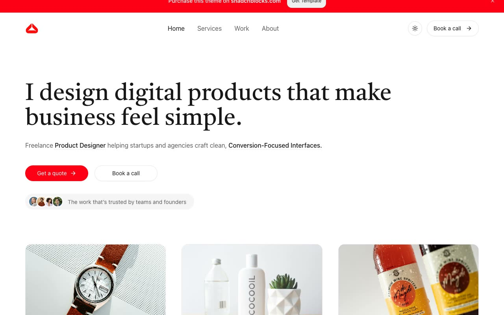

# Hatch Portfolio Template

[](./demo.mp4)

Hatch is a self-contained static reproduction of the Shadcnblocks portfolio template. It includes the home page, about page, service pages, work index, six case studies, contact and booking flows, subscription page, and custom 404 page.

## Run locally

Serve this folder with any static HTTP server:

```sh
python3 -m http.server 8000
```

Open `http://localhost:8000` in a browser.

## Included behavior

- Responsive navigation with a full-height mobile menu
- Light and dark themes with local persistence
- Dismissible purchase banner
- Work-card and button hover states
- Functional contact form fields
- Locally hosted fonts, icons, and imagery

The implementation uses plain HTML, CSS, and JavaScript with no build step or external runtime dependency.

Original reference: <https://hatch-nextjs-template.vercel.app/>
