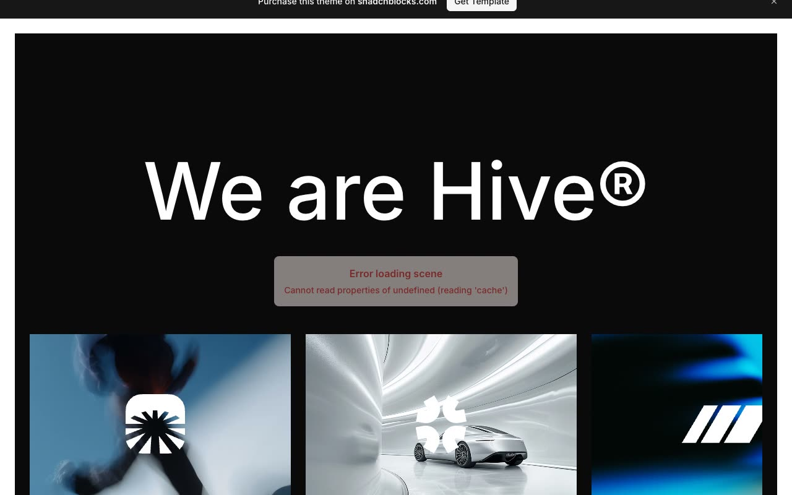

# Hive Branding Agency Template

[](./demo.mp4)

A self-contained reproduction of the Shadcnblocks Hive template. It includes all 22 live routes, local imagery and fonts, responsive layouts, light and dark themes, project filters, contact selections, carousel controls, banner dismissal, a live clock, and the fullscreen navigation menu.

## Run

Serve the folder with any static server:

```sh
python3 -m http.server
```

Open `index.html` from the printed local URL. The site has no build step and works offline.

## Pages

The project includes home, studio, services, four service detail pages, work, twelve project detail pages, contact, and careers.

## Reference

[Shadcnblocks Hive template](https://www.shadcnblocks.com/template/hive)
