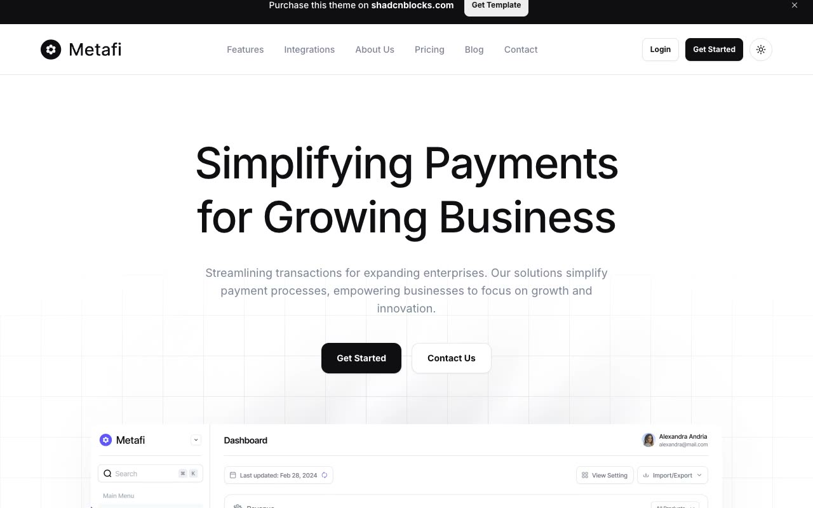

# Metafi Fintech SaaS Template

[](./demo.mp4)

Metafi is a static recreation of the Shadcnblocks fintech and payments template. It preserves the responsive marketing layouts, dark theme, mobile navigation, pricing controls, FAQ accordions, authentication forms, legal content, and complete blog collection without requiring a build step.

## Routes

The audit covers 19 live routes:

- Home
- Features
- Integrations
- About
- Pricing
- Blog index
- Six individual blog articles
- Careers
- Contact
- Login
- Sign up
- Privacy policy
- Terms
- Cookie policy

Every route was checked at 390, 768, and 1280 pixels. Shared styling is in `reference.css`, and interactive behavior is in `app.js`.

## Run locally

```sh
python3 -m http.server 8000
```

Open <http://localhost:8000/index.html>.

## Credit

Original design: [Metafi by Shadcnblocks](https://www.shadcnblocks.com/template/metafi)

Live reference: [Metafi Next.js demo](https://metafi-nextjs-template.vercel.app/)
