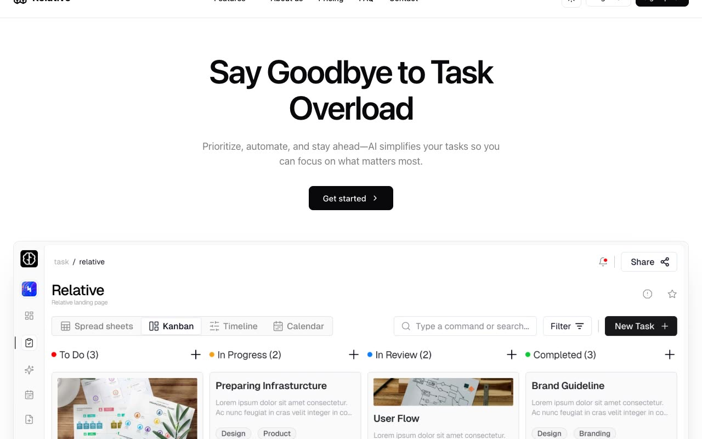

# Relative SaaS Template

[](./demo.mp4)

A static, multi-page reproduction of the Relative productivity template. The current live design was captured route by route and rebuilt with its rendered HTML, responsive CSS, local imagery, and lightweight browser interactions.

## Run locally

Serve this folder over HTTP:

```sh
python3 -m http.server 8000
```

Then open <http://localhost:8000/index.html>.

## Pages

- Home
- About
- Contact
- FAQ
- Login
- Pricing
- Sign up
- Terms of service

## Audit coverage

- All eight live routes were discovered from the deployed site and reproduced locally.
- Every route was checked at 390, 768, and 1280 pixel widths, for 24 responsive comparisons in total.
- Page text, document width, and rendered height match the live reference at every checked size.
- Mobile navigation, theme switching, FAQ expansion, and pricing period selection were replayed against both versions.
- `reference.css` contains the current responsive design rules used by the captured pages.
- Images are served from `assets/`, so the visual content does not depend on the live deployment.
- `demo.mp4` and `poster.jpg` show the audited home page.

## Reference

Original design: [Relative on Shadcnblocks](https://www.shadcnblocks.com/template/relative)

Live reference: [Relative Next.js template](https://relative-nextjs-template.vercel.app/)
