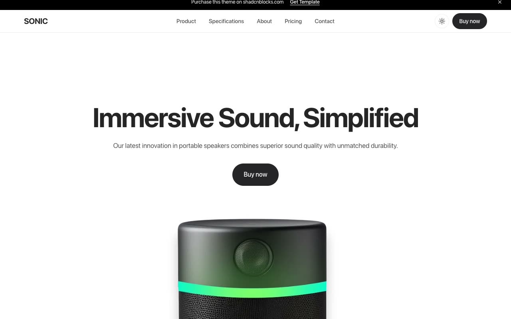

# Sonic Audio Product Template

[](./demo.mp4)

A static, multi-page reproduction of the Sonic premium speaker template. The current live design was captured route by route and rebuilt with its rendered HTML, responsive CSS, local imagery and fonts, and lightweight browser interactions.

## Run locally

Serve this folder over HTTP:

```sh
python3 -m http.server 8000
```

Then open <http://localhost:8000/index.html>.

## Pages

- Home
- Product
- Specifications
- About
- Pricing
- Contact
- Blog index
- Six blog articles
- Terms of service
- Privacy policy

## Audit coverage

- All 15 live routes were discovered from the deployed site and reproduced locally.
- Every route was checked at 390, 768, and 1280 pixel widths, for 45 responsive comparisons in total.
- Page text, document width, and rendered height match the live reference at every checked size.
- Mobile navigation, theme switching, banner dismissal, and FAQ selection were replayed against both versions.
- `reference.css` contains the current responsive design rules used by the captured pages.
- Images, the Sonic logo, and SF Pro Display font files are served locally from `assets/`.
- `demo.mp4` and `poster.jpg` show the audited home page.

## Reference

Original design: [Sonic on Shadcnblocks](https://www.shadcnblocks.com/template/sonic)

Live reference: [Sonic Next.js template](https://sonic-nextjs-template.vercel.app/)
