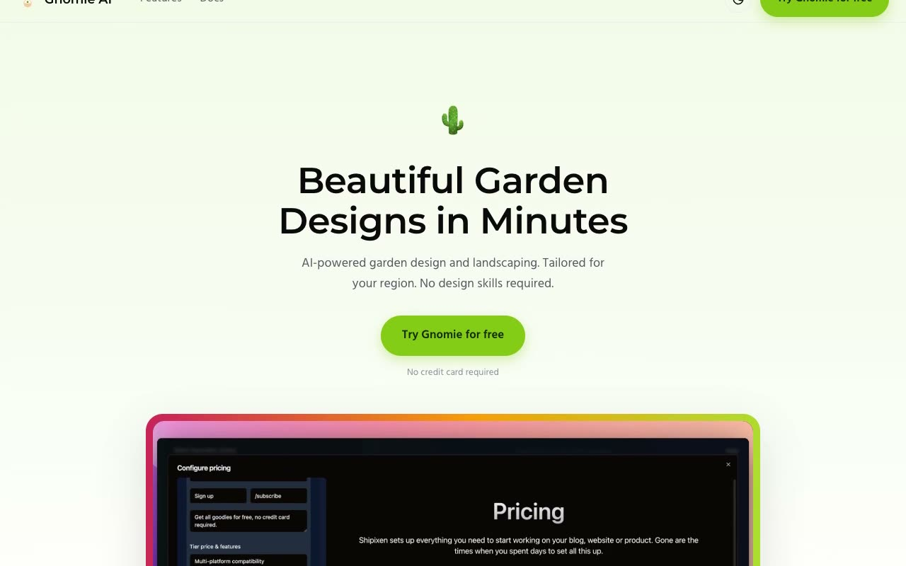

# Gnomie AI SaaS Landing Page Template Clone

[](./demo.mp4)

Gnomie AI is a pixel-faithful clone of the "Gnomie AI" garden-design landing-page template from Shipixen and Page UI. It is rebuilt as a single-page SaaS marketing site in plain HTML, CSS, and vanilla JavaScript with no build step and all assets vendored locally. It reproduces the full long-scroll layout and interactive states.

## Run

No build step is required. Serve the folder with any static server and open `index.html`:

```sh
python3 -m http.server
```

Then visit the printed local URL, such as `http://localhost:8000`.

## Notes

- `script.js` handles the theme toggle (persisted under the `gnomie-theme` key), mobile menu, rotating user strips, FAQ accordion, and pricing monthly/annual toggle.
- All images and fonts are vendored under `assets/`.
- `prompt.md` holds the full build spec and `demo.mp4` shows the page in motion.

## Credits

Faithful clone of an existing design, recreated for study/learning. All credit for the original design goes to its creators.

**Original:** Shipixen (Page UI), <https://shipixen.com/demo/landing-page-templates/template/gnomie-ai>
