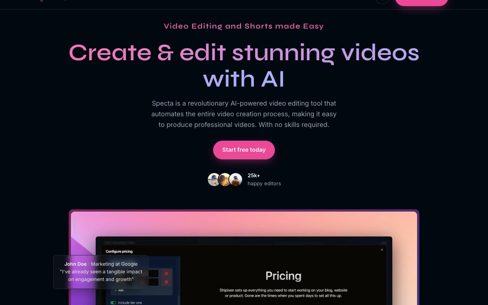

# Specta — AI Video-Editing SaaS Landing Page Template Clone (Vanilla HTML/CSS/JS)

[](./demo.mp4)

Specta is a self-contained, pixel-faithful clone of the dark "Specta" marketing landing page template for a fictional video-editing SaaS. It uses plain HTML, CSS, and vanilla JavaScript with no build step, and all assets are vendored locally. The page ships dark by default with a light and dark theme toggle, gradient hero, autoplay product video, ticker marquee, alternating feature sections, monetize grid, testimonials, and multi-column footer.

## Run

This is a static site with no build step. Serve the folder with any static file server, for example:

```sh
python3 -m http.server 8000
```

Then open <http://localhost:8000/> (entry file is `index.html`).

## Notes

- **Theme**: dark is the shipped default. The theme toggle flips `:root.dark`, and all colors resolve from CSS custom properties that respond to `:root.dark` / `prefers-color-scheme`. The choice is persisted in `localStorage`.
- **Motion**: an infinite horizontal marquee powers the logo/testimonial ticker; sections fade and rise in on scroll via `IntersectionObserver`, with a load-time safety fallback that reveals everything after a short delay (useful for full-page captures and reduced-motion contexts).
- **Hero**: a framed autoplay product video sits in the hero with floating testimonial popovers.
- `prompt.md` holds the full build spec, including the palette, type scale, and section-by-section layout.

## Credits

Faithful clone of an existing design, recreated for study/learning. All credit for the original design goes to its creators.

**Original:** Page UI (Specta) — <https://shipixen.com/demo/landing-page-templates/template/specta>

---

Part of the [Templates](../../../) collection in the [claude-directory](../../../../).
