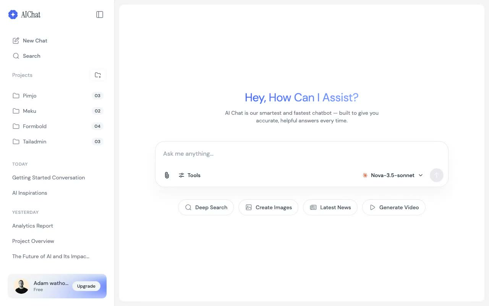

# AIChat

[](./demo.mp4)

A self-contained HTML, CSS, and JavaScript reproduction of the TailGrids AIChat interface.

## Run

Serve this directory with any static file server:

```sh
python3 -m http.server 8080
```

Then open `http://localhost:8080`.

## Features

- Responsive chat workspace and navigation drawer
- Keyboard-accessible mobile and desktop sidebar controls
- Auto-resizing message composer
- Quick-action prompts that populate the composer
- Send button and Enter-key submission behavior
- Project and conversation selection states

The original design is credited to TailGrids. See the [live reference](https://aichat.demos.tailgrids.com).

`prompt.md` contains the detailed build specification. `demo.mp4` shows the interface in motion.
