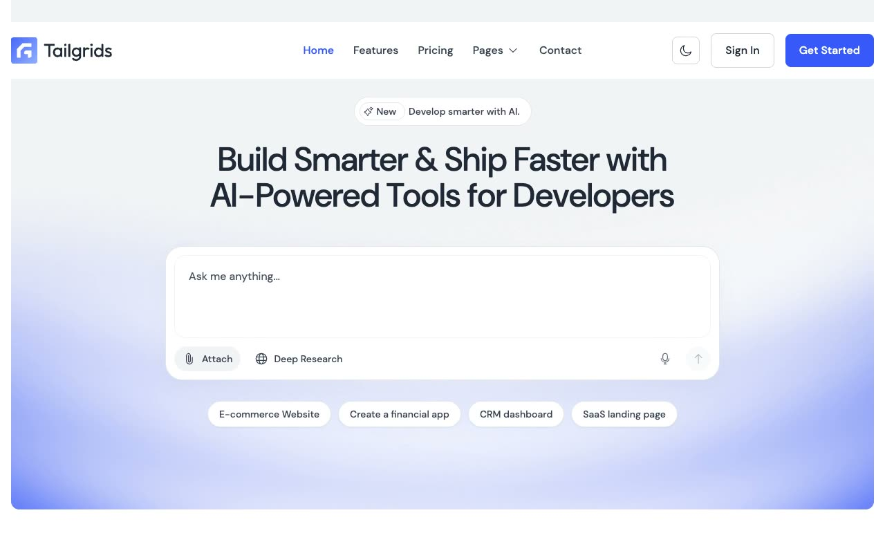

# AISpace

[](./demo.mp4)

A self-contained HTML, CSS, and JavaScript reproduction of the TailGrids AISpace SaaS website.

## Run

Serve this directory with any static file server:

```sh
python3 -m http.server 8080
```

Then open `http://localhost:8080`.

## Pages

- Home, features, pricing, and about
- Blog index and article detail
- Sign in, sign up, and contact
- Custom not-found page

## Features

- Persistent light and dark themes
- Responsive navigation with keyboard support
- Interactive hero composer and topic shortcuts
- Testimonial carousel and logo marquee
- Scroll reveal and sticky header behavior
- Accessible forms and controls across all routes

The original design is credited to TailGrids. See the [live reference](https://aispace.demos.tailgrids.com).

`prompt.md` contains the detailed build specification. `demo.mp4` shows the website in motion.
