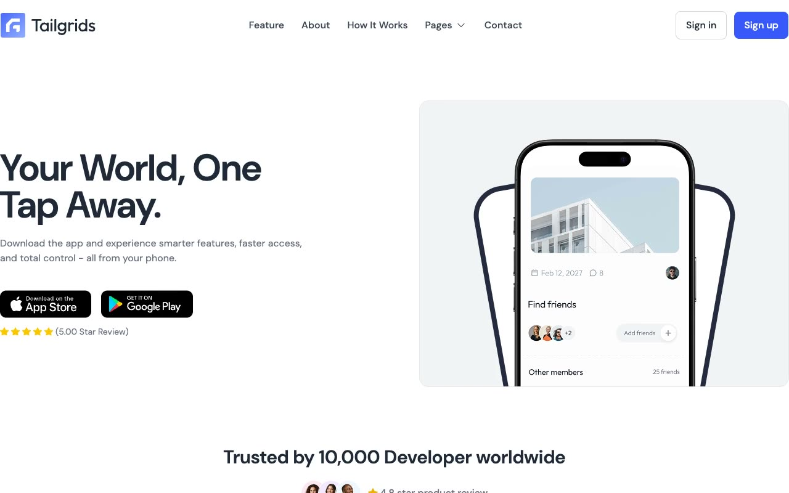

# AppSpace

[](./demo.mp4)

A self-contained HTML, CSS, and JavaScript reproduction of the TailGrids AppSpace mobile app website.

## Run

```sh
python3 -m http.server 8080
```

Then open `http://localhost:8080`.

## Pages

- Home and pricing content
- Blog index and article detail
- Sign in, sign up, and contact
- Custom not-found page

## Features

- Persistent light and dark themes
- Responsive navigation with keyboard support
- FAQ accordion and sticky header
- Accessible forms and controls
- Scroll reveal and responsive landing-page sections

The original design is credited to TailGrids. See the [live reference](https://appspace.demos.tailgrids.com).

`prompt.md` contains the detailed build specification. `demo.mp4` shows the website in motion.
