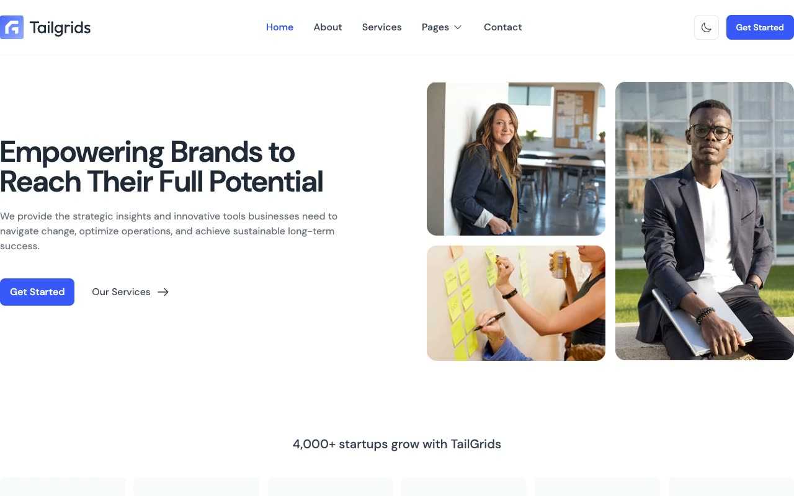

# BizSpace

[](./demo.mp4)

A self-contained HTML, CSS, and JavaScript reproduction of the TailGrids BizSpace corporate website.

## Run

```sh
python3 -m http.server 8080
```

Then open `http://localhost:8080`.

## Pages

- Home, about, and services
- Portfolio index and project detail
- Blog index and article detail
- Contact and custom not-found page

## Features

- Persistent light and dark themes
- Responsive navigation with keyboard support
- Accessible contact and newsletter forms
- Portfolio, testimonial, and sticky-header interactions
- Fully local visual assets

The original design is credited to TailGrids. See the [live reference](https://bizspace.demos.tailgrids.com).

`prompt.md` contains the detailed build specification. `demo.mp4` shows the website in motion.
