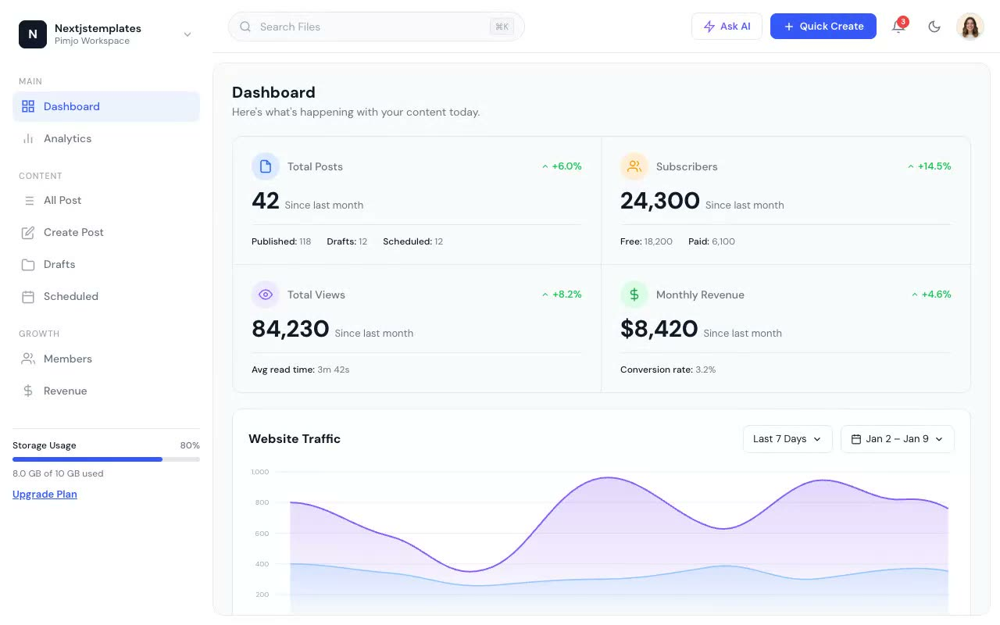

# TailGrids CMS

A responsive publishing dashboard with analytics, content management, member data, revenue reporting, and persistent light and dark themes. The project runs as static HTML, CSS, and JavaScript with no build step.

## Pages

| File | View |
| --- | --- |
| `index.html` | Dashboard |
| `analytics.html` | Analytics |
| `all-posts.html` | All posts |
| `create-post.html` | Post editor |
| `drafts.html` | Drafts |
| `scheduled.html` | Scheduled posts |
| `members.html` | Members |
| `revenue.html` | Revenue and monetization |

## Run locally

Serve this directory with any static file server, then open `index.html`.
