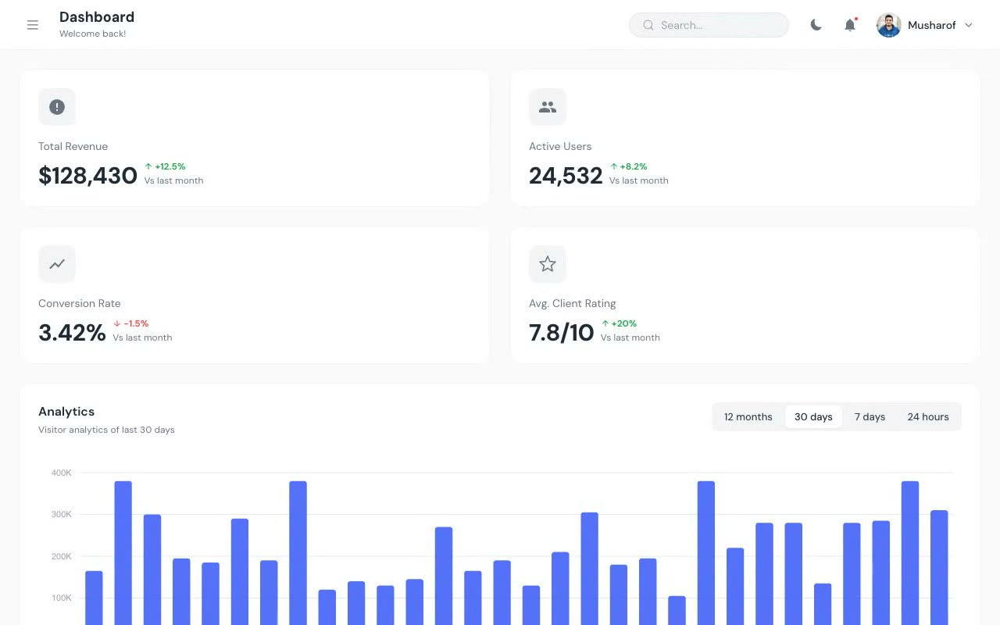

# DashSpace Admin Dashboard

A responsive admin dashboard with analytics, calendar, tables, charts, profile management, and persistent light and dark themes. The static project requires no build step.

## Pages

| File | View |
| --- | --- |
| `index.html` | Analytics dashboard |
| `calendar.html` | Calendar |
| `tables.html` | Data tables |
| `profile.html` | User profile |
| `charts.html` | Chart library |

## Run locally

Serve this directory with any static file server, then open `index.html`.
