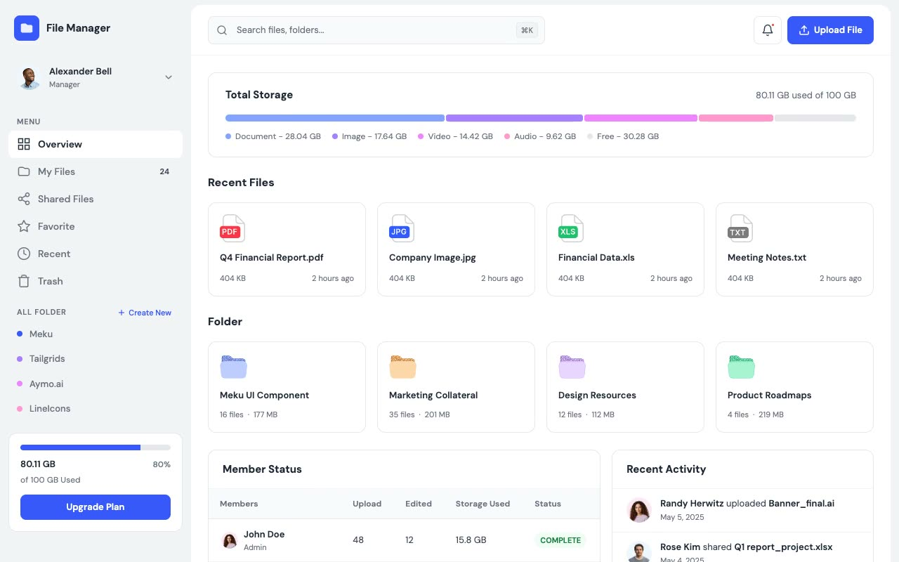

# File Manager Dashboard

A responsive file management dashboard with overview metrics, folders, recent and shared files, favorites, and trash management. The static project requires no build step.

## Pages

| File | View |
| --- | --- |
| `index.html` | Overview |
| `my-files.html` | My files |
| `recent.html` | Recent files |
| `shared.html` | Shared files |
| `favorite.html` | Favorites |
| `trash.html` | Trash |

## Run locally

Serve this directory with any static file server, then open `index.html`.
