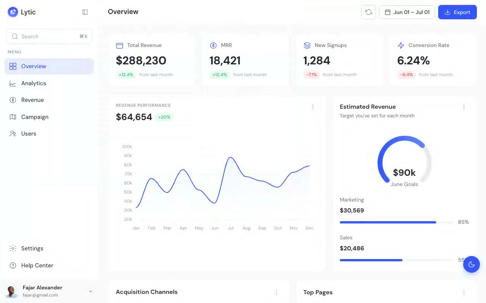

# Lytic Analytics Dashboard

[](./demo.mp4)

Lytic is a responsive analytics dashboard built with HTML, CSS, and JavaScript. It includes persistent light and dark themes, a collapsible desktop sidebar, mobile navigation, accessible controls, and ApexCharts data visualizations.

## Pages

| Page | Content |
| --- | --- |
| `index.html` | Overview metrics, revenue performance, acquisition channels, and top pages |
| `analytics.html` | Traffic trends, device sessions, user locations, and top pages |
| `revenue.html` | Revenue growth, subscription plans, and subscription activity |
| `campaign.html` | Campaign performance, channel distribution, and campaign details |
| `users.html` | User records, roles, plans, statuses, and pagination |
| `settings.html` | Workspace, timezone, and currency settings |
| `help.html` | Support shortcuts, ticket form, and help topics |

## Run locally

```bash
python3 -m http.server 8080
```

Open `http://localhost:8080` in a browser.

## Reference

The visual reference is available at <https://lytic.demos.tailgrids.com>.
