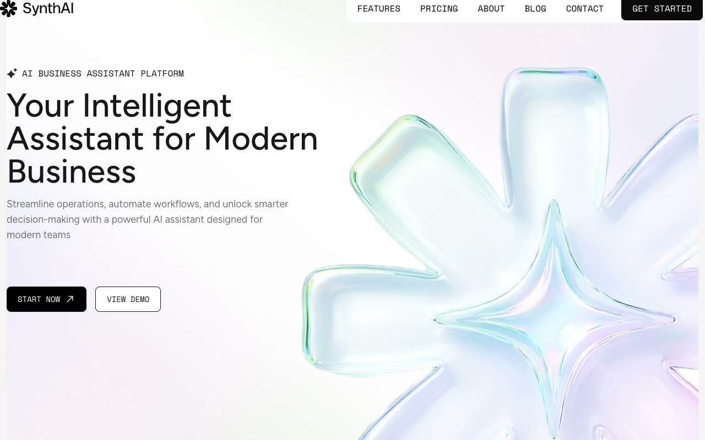

# SynthAI Business Assistant Template

[](./demo.mp4)

SynthAI is a responsive, multi-page business assistant template based on the TailGrids reference. It uses static HTML and CSS with local assets and requires no build step.

## Run

Serve the directory with any static web server:

```sh
python3 -m http.server 8080
```

Open `http://localhost:8080` in a browser.

## Routes

- Home
- Features
- Pricing
- About
- Blog
- Contacts
- 404
- Blog details, currently routed to the reference error page
- Privacy policy, currently routed to the reference error page
- Terms, currently routed to the reference error page

## Features

- Responsive desktop, tablet, and mobile layouts
- Accessible mobile navigation with expanded state
- FAQ accordion interactions
- Local fonts, images, logos, and interface assets

## Reference

The original design is available from [TailGrids](https://synthai.demos.tailgrids.com/).
