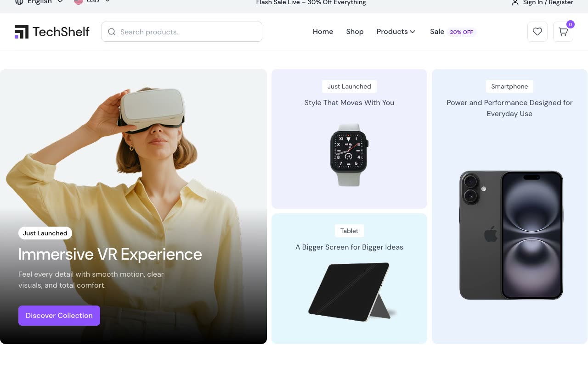

# TechSelf Electronics Store Template

[](./demo.mp4)

TechSelf is a responsive, multi-page electronics storefront based on the TailGrids reference. It uses static HTML, CSS, and JavaScript with local assets and requires no build step.

## Run

Serve the directory with any static web server:

```sh
python3 -m http.server 8080
```

Open `http://localhost:8080` in a browser.

## Routes

- Home
- Shop
- Product details
- Checkout
- Order confirmation

## Features

- Responsive desktop, tablet, and mobile layouts
- Search suggestions and mobile navigation
- Product gallery and quantity controls
- Persistent shopping cart drawer
- Checkout and order confirmation flow
- Accessible FAQ accordion interactions

## Reference

The original design is available from [TailGrids](https://techself.demos.tailgrids.com/).
