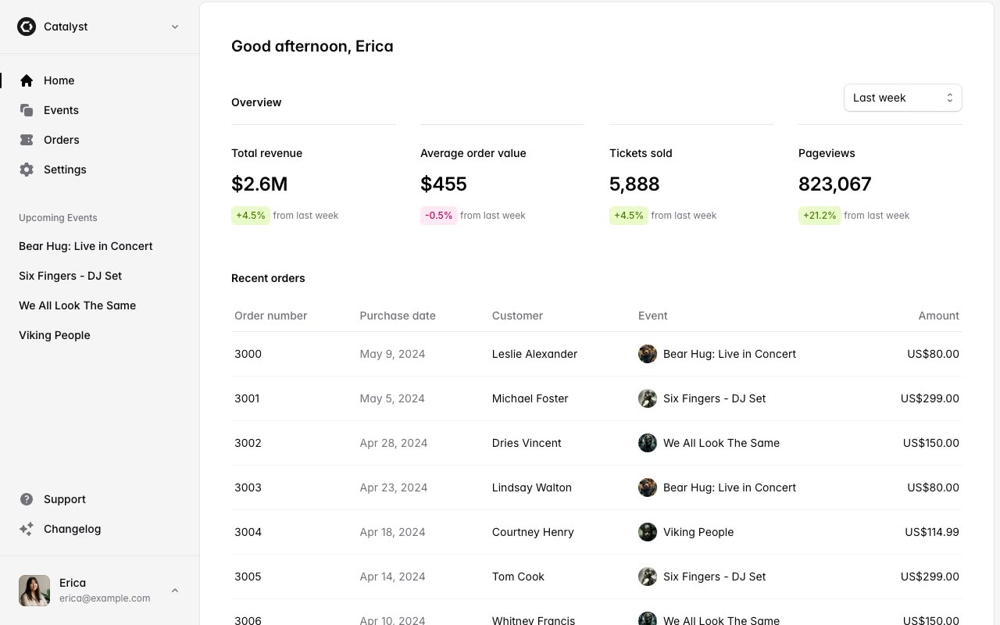

# Catalyst Event Management Dashboard

[](./demo.mp4)

A faithful static recreation of the Tailwind Plus Catalyst application demo. The project includes the dashboard, event and order indexes, four event details, 26 order details, organization settings, and authentication screens.

## Run

Serve this directory with any static file server and open `index.html`.

```sh
python3 -m http.server 8000
```

The interface is built with plain HTML, CSS, and JavaScript. Fonts, event artwork, avatars, team marks, and flags are stored locally for offline use.

## Pages

- Dashboard: `index.html`
- Events: `events.html` and `events/1000.html` through `events/1003.html`
- Orders: `orders.html` and `orders/3000.html` through `orders/3025.html`
- Settings: `settings.html`
- Authentication: `login.html`, `register.html`, and `forgot-password.html`

The optional `build.py` utility regenerates the static page set from the captured page structures.

Original design: [Tailwind Plus Catalyst](https://catalyst-demo.tailwindui.com)
