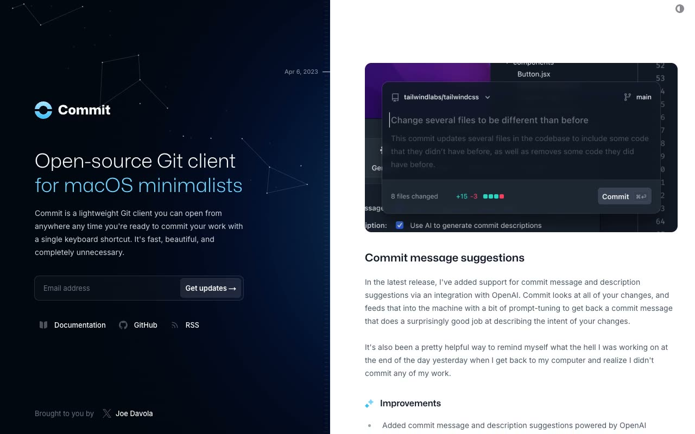

# Commit Changelog Template

[](./demo.mp4)

A static recreation of the Tailwind Plus Commit changelog template. The page pairs a dark product introduction with four dated release entries, responsive screenshot cards, a persistent light and dark theme control, and polished form and link states.

## Run

Serve the folder with any static HTTP server:

```sh
python3 -m http.server
```

Then open `index.html` through the server, such as `http://localhost:8000/`.

## Features

- Responsive single-page changelog layout
- Four complete release entries with local product imagery
- Light and dark themes persisted in `localStorage`
- Keyboard-accessible email form and theme control
- Local Inter and Mona Sans fonts
- Anchor navigation for every release
- RSS link to the live Commit feed

The page has no build step or runtime dependencies. Its stylesheet, scripts, fonts, images, and favicon are stored under `assets/`.

## Reference

Original design: [Tailwind Plus Commit](https://tailwindcss.com/plus/templates/commit/preview)
