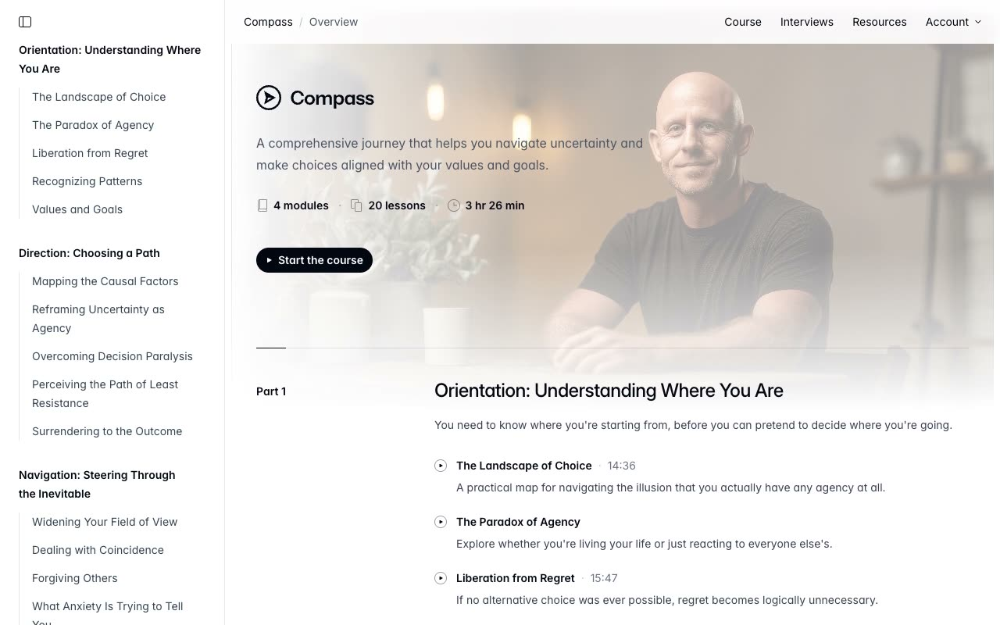

# Compass Online Course Template

[](./demo.mp4)

A self-contained, pixel-faithful recreation of the Tailwind Plus Compass course template. The site includes a course overview, 20 lesson pages, an interviews grid, six interview detail pages, and a resources page. It uses static HTML, the original compiled Tailwind CSS, and dependency-free JavaScript, with all fonts, images, and videos stored locally.

## Run

Serve the folder with any static web server:

```sh
python3 -m http.server 8000
```

Then open <http://localhost:8000/>.

## Features

- Responsive course sidebar and mobile navigation drawers
- Account menu with keyboard dismissal
- Scroll-aware lesson and interview navigation
- Native video playback with an off-screen mini-player
- Local Inter Variable and Geist Mono fonts
- Offline images, posters, and video clips

## Pages

The template contains 29 routes: the course overview, 20 lessons, the interviews grid, six interview profiles, and the resources page. Lesson pages live beside `index.html`, while interview profiles are under `interviews/`.

## Reference

The original design is the [Tailwind Plus Compass template](https://tailwindcss.com/plus/templates/compass/preview) by Tailwind Labs.
