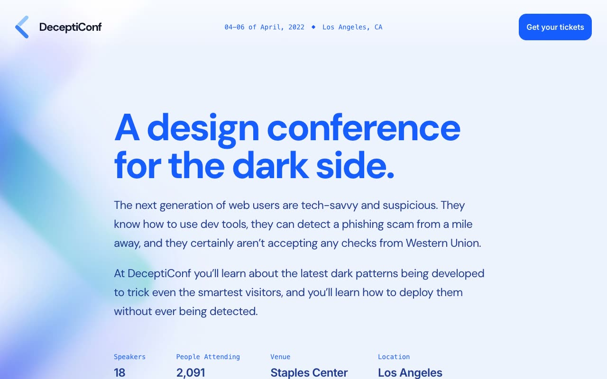

# Keynote Conference Template

[](./demo.mp4)

A self-contained reproduction of the Tailwind Plus Keynote conference template. The page includes the complete DeceptiConf layout, all 18 speakers, three schedule days, sponsor artwork, newsletter signup, responsive tab groups, keyboard navigation, hover states, and local fonts and imagery.

## Run

Serve the folder with any static server:

```sh
python3 -m http.server
```

Open `index.html` from the printed local URL. The site has no build step and works offline.

## Reference

[Tailwind Plus Keynote template](https://tailwindcss.com/plus/templates/keynote/preview)
