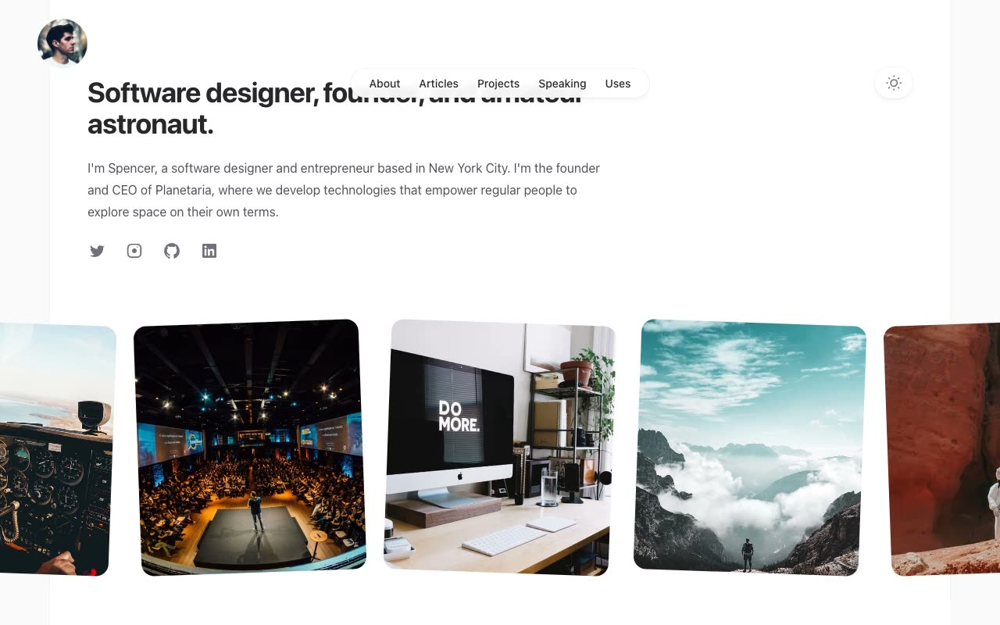

# Spotlight — Tailwind UI Personal Portfolio Template Clone

[](./demo.mp4)

A pixel-faithful, self-contained HTML/CSS/JS clone of the Tailwind UI **Spotlight** personal portfolio template — a clean, minimal developer/designer portfolio with full dark-mode support, six unique pages, article detail pages, animated sticky header, frosted-glass nav pill, and a photo grid. Runs offline with zero build steps required.

## Pages

| Page | File |
|------|------|
| Home | `index.html` |
| About | `about.html` |
| Articles index | `articles.html` |
| Article: Crafting a Design System | `articles/crafting-a-design-system-for-a-multiplanetary-future.html` |
| Article: Introducing Animaginary | `articles/introducing-animaginary.html` |
| Article: Rewriting the cosmOS Kernel in Rust | `articles/rewriting-the-cosmos-kernel-in-rust.html` |
| Projects | `projects.html` |
| Speaking | `speaking.html` |
| Uses | `uses.html` |

## Design Tokens

- **Light palette:** `#F4F4F5` outer bg / `#FFFFFF` content panel / `#18181B` headings / `#52525B` body / `#14B8A6` teal accent
- **Dark palette:** `#000000` bg / `#18181B` panel / `#F4F4F5` text / `#2DD4BF` teal accent
- **Typography:** System font stack (`ui-sans-serif, system-ui, sans-serif`) — no external font loading
- **Radii:** `9999px` for avatar/nav pill; `1rem` for cards; `0.75rem` for photo grid
- **Interactions:** Dark-mode toggle (localStorage), mobile hamburger menu, avatar scroll-shrink animation, hover highlight backgrounds on article/project cards

## Run Locally

```bash
# Any static server works — no build step required
python3 -m http.server 8080
# Then open http://localhost:8080/
```

Or simply open `index.html` directly in a browser.

## Stack

Plain HTML · CSS custom properties · Vanilla JS · No frameworks · No build step · Assets vendored locally

---

Part of the [tailwindcss provider collection](../) · [All templates](../../) · [Back to root](../../../../README.md)

## Credits

Faithful clone of an existing design, recreated for study/learning. All credit for the original design goes to its creators.

**Original:** Tailwind UI (Tailwind CSS Plus) — <https://tailwindcss.com/plus/templates/spotlight/preview>
