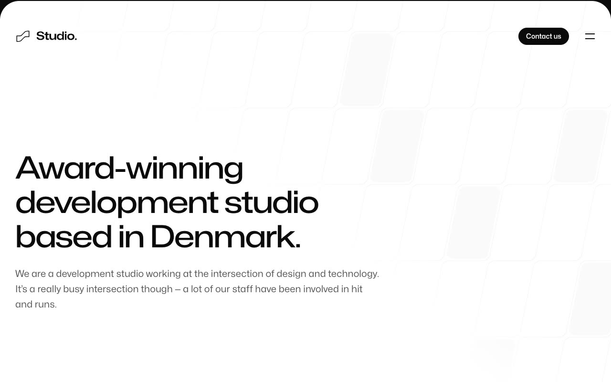

# Studio agency template

[](./demo.mp4)

A self-contained static recreation of the Tailwind Plus Studio agency template. The project includes 12 pages with local fonts, images, logos, styles, and interactions, so it runs without a build step or external asset host.

## Run

Serve the project directory with any static file server:

```sh
python3 -m http.server
```

Then open <http://localhost:8000/>.

## Pages

- Home
- About
- Process
- Work index
- FamilyFund case study
- Unseal case study
- Phobia case study
- Blog index
- Future of web development article
- Going back to the office article
- Component naming article
- Contact

## Features

- Responsive layouts across mobile, tablet, and desktop widths
- Expanding navigation panel with matching animated states
- Scroll-reveal transitions with reduced-motion support
- Locally hosted Mona Sans variable font
- Locally hosted photography, client logos, and favicon
- Static HTML, CSS, and JavaScript with no runtime dependencies

## Reference

The design follows the [Tailwind Plus Studio template](https://tailwindcss.com/plus/templates/studio/preview).
