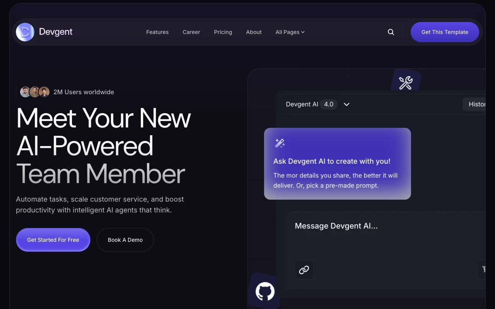

# Devgent

[](./demo.mp4)

This static reconstruction matches the current Devgent template across 52 live routes. It retains the original dark visual system, responsive layouts, page content, search dialog, mobile navigation, feature tabs, pricing switch, media dialogs, and FAQ accordions.

## Run

```sh
cd templates/premium/themefisher/devgent-nextjs
python3 -m http.server
```

Open [http://localhost:8000](http://localhost:8000).

## Coverage

- Home, about, features, pricing, contact, changelog, privacy, and terms pages
- Integration listing and nine integration detail routes
- Career listing and thirteen job detail routes
- Blog listing, pagination, six posts, ten categories, and two author routes
- Mobile, tablet, and desktop layouts
- Search, navigation, tabs, pricing, media, and accordion interactions

The original reference is [Themefisher Devgent](https://themefisher.com/demo?theme=devgent-nextjs).
