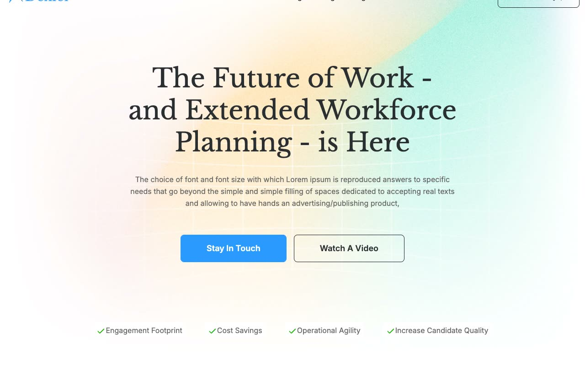

# Dexler

[](./demo.mp4)

This static reconstruction matches the current Dexler workforce platform template across all 31 live routes. It retains the original responsive layout, typography, imagery, carousels, navigation, video dialogs, and component states.

## Run

```sh
cd templates/premium/themefisher/dexler-nextjs
python3 -m http.server
```

Open [http://localhost:8000](http://localhost:8000).

## Coverage

- Eleven primary site routes
- Twelve blog posts and the second blog index page
- Seven career detail routes
- Mobile, tablet, and desktop layouts
- Mobile navigation, video dialogs, dropdowns, and accordions

The original reference is [Themefisher Dexler](https://themefisher.com/demo?theme=dexler-nextjs).
