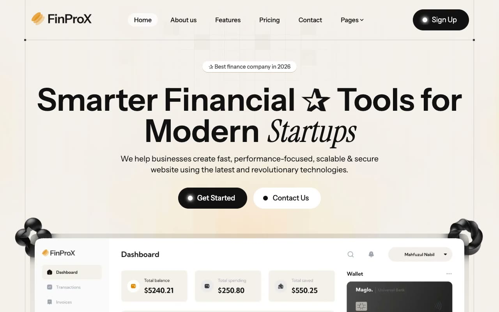

# FinProx Financial SaaS Template

[](./demo.mp4)

A faithful static reconstruction of the Themefisher FinProx NextJS template. The site preserves the original warm financial editorial style, responsive layouts, complete page content, and client-side interactions without requiring a build step.

## Pages

The project includes all 25 routes discovered on the live reference:

- Home, about, features, pricing, and contact
- Blog listing and five blog articles
- Case studies listing and three case study details
- Careers listing and two job details
- Changelog, integrations, sign up, sign in, and elements
- Privacy policy and terms of service

## Interactions

- Responsive navigation and dropdown menus
- Solution tabs and component tabs
- Monthly and yearly pricing
- Testimonial carousels
- FAQ and component accordions
- Expandable integration directory
- Embedded and native video controls

## Run

Serve the project directory with any static server:

```sh
python3 -m http.server
```

Then open `http://localhost:8000`.

## Reference

[Themefisher FinProx NextJS](https://themefisher.com/demo?theme=finprox-nextjs)
