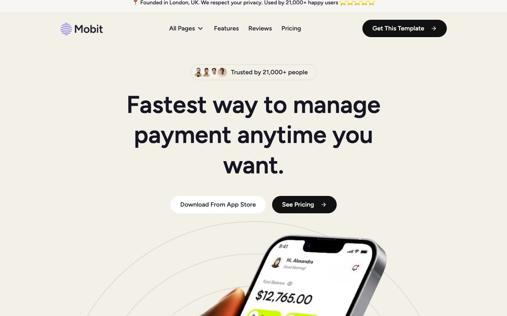

# Mobit Finance Template

[](./demo.mp4)

A faithful static reconstruction of the Themefisher Mobit NextJS template. The project preserves the original financial app content, responsive layouts, visual system, and client-side interactions without requiring a build step.

## Pages

The project includes all 24 routes discovered on the live reference:

- Home, features, pricing, reviews, and contact
- Blog listing, two pagination routes, and thirteen blog articles
- Elements, privacy policy, and terms

## Interactions

- Responsive navigation and page dropdown
- Monthly and yearly pricing
- FAQ and component accordions
- Component content tabs
- Responsive feature carousel
- Embedded video layout

## Run

Serve the project directory with any static server:

```sh
python3 -m http.server
```

Then open `http://localhost:8000`.

## Reference

[Themefisher Mobit NextJS](https://themefisher.com/demo?theme=mobit-nextjs)
