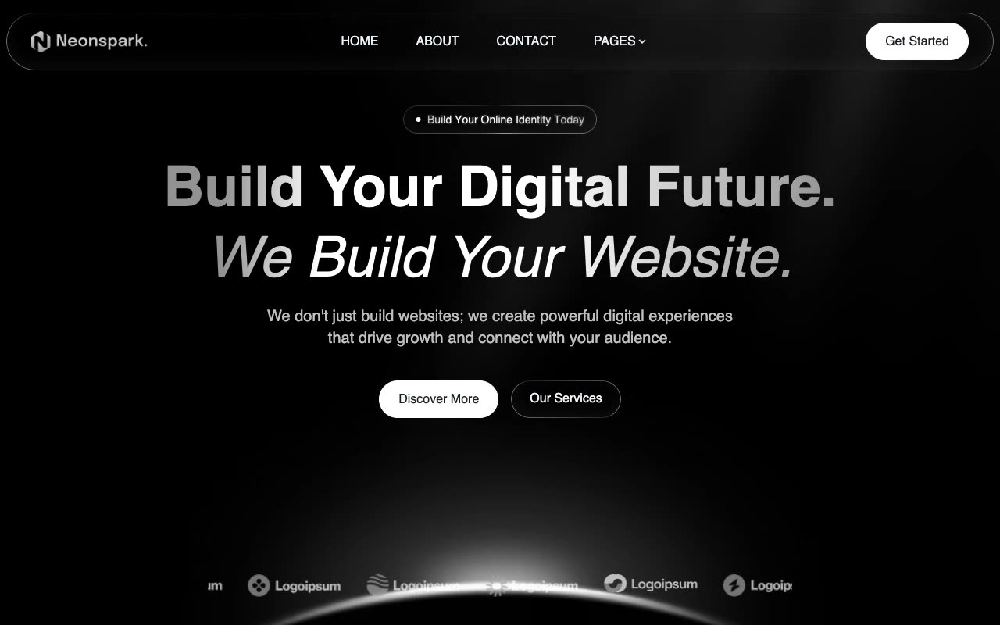

# Neonspark NextJS Template

[](./demo.mp4)

A static HTML reproduction of Themefisher's Neonspark NextJS template. The audited clone follows the complete live site across 28 routes with responsive layouts, dark agency styling, scroll reveals, navigation, pricing controls, FAQ accordions, process steps, and design-system components.

## Routes

- Home, About, Contact, FAQ, Pricing, Elements, Teams, Work, Privacy Policy, and Terms
- Blog index, pagination, and four article routes
- Career index and four job detail routes
- Services index and six service detail routes

## Run locally

```sh
python3 -m http.server 8080
```

Open `http://localhost:8080`.

## Reference

[Themefisher Neonspark demo](https://neonspark-nextjs.vercel.app)
