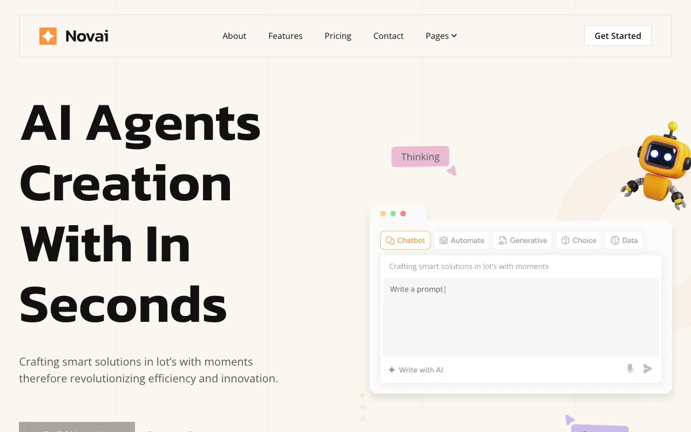

# Novai SaaS Marketing Template

[](./demo.mp4)

Novai is a static recreation of the Themefisher Novai marketing site. It includes the complete public design, responsive layouts, interactive pricing, accordions, tabs, sliders, forms, and motion details.

## Routes

The project contains 57 routes:

- Home, About, Contact, Pricing, Integrations, Features, Careers, FAQs, Elements, Privacy Policy, and Terms and Conditions
- 16 individual blog posts
- 13 individual career listings
- 9 individual case studies
- 6 individual feature pages
- Blog, Careers, and Case Studies indexes

## Run locally

Serve this directory with any static file server:

```sh
python3 -m http.server
```

Then open `http://localhost:8000`.

## Verification

The `.audit` directory contains route, responsive screenshot, pixel similarity, and interaction verification evidence. The demo video and poster show the current implementation.

## Original design

[Themefisher Novai demo](https://novai-nextjs.vercel.app)
