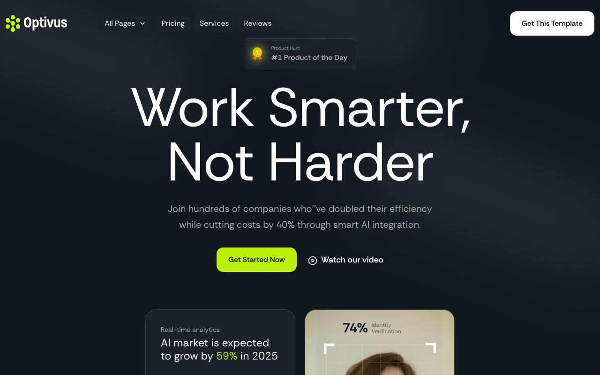

# Optivus SaaS Marketing Template

[](./demo.mp4)

Optivus is a static recreation of the Themefisher Optivus marketing site. It preserves the complete public design, responsive layouts, mobile navigation, FAQ behavior, testimonial controls, forms, and motion details.

## Routes

The project contains 31 routes:

- Home, two About variants, Contact, Elements, How It Works, two Pricing variants, Reviews, Services, Team, Privacy Policy, Terms and Conditions, Terms of Service, and 404
- Blog index with a second pagination route
- 10 individual blog posts
- Three individual author pages

## Run locally

Serve this directory with any static file server:

```sh
python3 -m http.server
```

Then open `http://localhost:8000`.

## Verification

The `.audit` directory contains route, responsive screenshot, pixel similarity, and interaction verification evidence. The demo video and poster show the current implementation.

## Original design

[Themefisher Optivus demo](https://optivus-nextjs.vercel.app)
