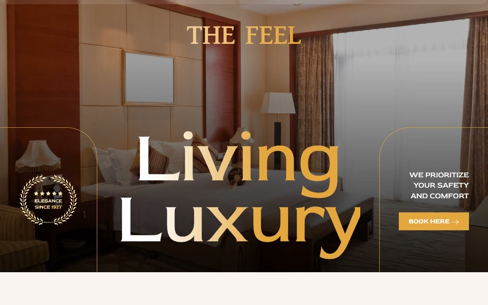

# Relux Hospitality Template

[](./demo.mp4)

Relux is a static recreation of the Themefisher Relux hospitality site. It preserves the complete public design, responsive layouts, navigation, room and hero sliders, forms, and content routes.

## Routes

The project contains 27 routes, including the home, hotel, cafe, room, blog, legal, contact, elements, and error experiences.

## Run locally

```sh
python3 -m http.server
```

Then open `http://localhost:8000`.

## Verification

The `.audit` directory contains route, responsive screenshot, pixel similarity, and interaction verification evidence. The demo video and poster show the current implementation.

## Original design

[Themefisher Relux demo](https://relux-nextjs.vercel.app)
